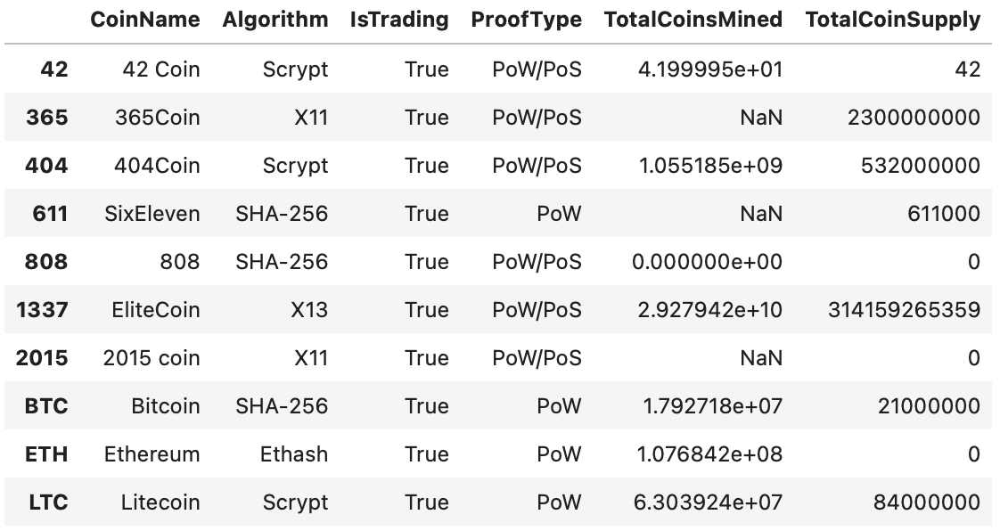
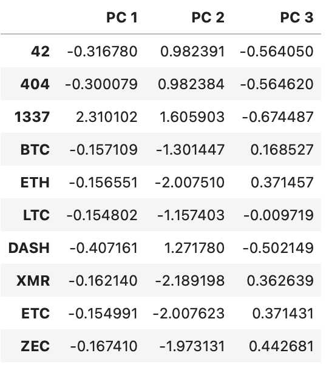

# Cryptocurrencies

Creating analysis to get into the cryptocurrency market.

## Classification system

In the vast universe of cryptocurrencies, grouping could be done as a mean of classification system in order to determine a new investment opening. Using a machine learning model to classify the data with an unsupervised algorithm approach and share the visualizations of the findings. 

### Initial look at data and preprocessing

The following picture represents the raw data to analyze.

First step is analyzing the data in order to preprocess it. Selecting the data where cryptocurrencies are being traded and coins mined from the raw data to filter on the active exhanges. 

Categorical values are converted to one hot encoding with pandas function "get_dummies", data standarized with sklearn "StandardScaler" and it was dimentionally reduced using principal components analysis. 

### Clustering using k-means

Finding the best value for k (number of clusters) is done by plotting the inertia of the grouping algorithm, value that represents the relative distance of samples to the closer cluster center. 

From the graph, it could be seen that an elbow shape is formed indicating that values of K equals to 4 are what best represents the number of clusters of the data as the change of inertia is less pronounced. 

### Visualizing Cryptocurrency Results

Once selected the classification algorithm, predictions on the data are used to classify the cryptocurrencies by groups and with the help of plotly express different visualizations will give a better idea of the clustering. 

The predictions are added to the data and summarized in the following table.

Making a 2 dimentional plot, it can be seen that data is agregatted on one side of the graph.

A 3D plot serves as a better way to visualize the effect of change on the principal components of the processed data.

#### Further exploration

Even though the classification system seems to identify different groups of cryptocurrencies, there is another exploratory phase to determine which combination of components will be best fro investment.

